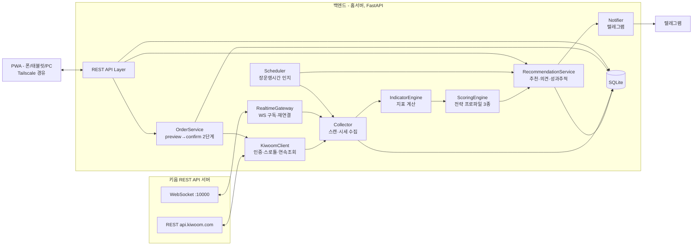

# SW 설계 — 주식 조회·추천·매매 앱 (HERONGS)

- 작업-ID: 20260725-stock-advisor
- 기준선: 초안 (미승인)
- 작성일: 2026-07-25
- 관련 요구사항: [requirements.md](requirements.md) (FR-01~17, NFR-01~06, AC-01~10)

작은 단일 사용자 프로젝트이므로 ADR을 별도 파일로 분리하지 않고 §8 「주요 결정」에 통합한다. 승인 시 §8의 각 결정이 승인된 것으로 본다.

## 1. 기술 스택 (제안)

| 영역 | 선택 | 근거 |
|---|---|---|
| 백엔드 언어 | Python 3.12 | 금융 데이터 처리 생태계(지표 계산), Phase 2 LLM 연동 용이, 개발 속도 |
| 웹 프레임워크 | FastAPI + uvicorn | async 기반이라 키움 REST/WebSocket 동시 처리에 적합, 자동 OpenAPI 문서 |
| HTTP/WS 클라이언트 | httpx(async) / websockets | 표준적 async 조합 |
| 스케줄러 | APScheduler | 장전/장중/장후 주기 작업을 프로세스 내에서 관리, 별도 인프라 불요 |
| DB | SQLite + SQLAlchemy | 단일 사용자·단일 프로세스에 충분, 백업은 파일 복사, 운영 부담 0 |
| 알림 | python-telegram-bot | FR-11/17 텔레그램 채널 |
| 프론트엔드 | React + TypeScript + Vite + vite-plugin-pwa | 반응형 PWA(D-04), 홈 화면 추가로 앱처럼 사용 |
| 차트 | lightweight-charts (TradingView OSS) | 캔들/거래량 차트에 최적, 경량 |

## 2. 시스템 구조



### 컴포넌트 책임

- **KiwoomClient** (FR-01, FR-02, NFR-01/03): 토큰 발급(au10001)·만료 전 자동 갱신·폐기, 모의/실전 도메인 전환(설정), 전 TR 공통 호출 계층. 요청 큐 + 토큰버킷 스로틀, 연속조회(cont-yn/next-key) 자동 처리, 호출량 초과 시 지수 백오프 재시도.
- **RealtimeGateway** (FR-13 실시간, 단타 프로파일): WebSocket 접속·로그인, 실시간 TR(0B 체결, 0D 호가잔량, 1h VI) 등록/해제, 조건검색(ka10171~10174, CNSRREQ) 요청, 끊김 감지 시 자동 재접속·재등록.
- **Collector** (FR-03, FR-10): 깔때기 1단계 — 랭킹 TR·조건검색으로 후보 수집 → 위생 필터(FR-12) → 후보 종목만 상세 TR 호출. 일봉 등 시세는 SQLite에 적재(NFR-06)하고 증분만 조회.
- **IndicatorEngine**: 이동평균, 이격도, 거래량 배율, 상대강도, 체결강도 집계 등 파생 지표 계산. 순수 함수 모듈로 유지해 단위 테스트 용이하게.
- **ScoringEngine** (FR-04~06): 전략 프로파일(장기/스윙/단타)을 플러그인 인터페이스(`Profile.score(candidate) -> Score`)로 구현. 가중치는 설정 테이블에서 로드(튜닝 가능). 시장 국면(FR-14)에 따라 추천 개수·기준점수 조절. Phase 2 LLM 레이어는 동일 인터페이스의 프로파일 확장으로 추가.
- **RecommendationService** (FR-04~07, FR-16): 추천 목록·개별 종목 의견 생성, 근거(점수 구성) 직렬화, 추천 이력 저장, 배치로 1/5/20일 경과 수익률 평가.
- **OrderService** (FR-08/09/15, NFR-02): 2단계 주문 흐름(§5.3). 가드레일(1회 상한, 실계좌 플래그) 검사. 모든 요청·응답을 order_log에 기록(NFR-05).
- **Scheduler** (NFR-04): 휴장일 캘린더·장 운영시간 기반으로 작업 주기 제어. 장전 브리핑(08:30), 장중 스캔(설정 주기), 마감 후 적재·성과평가·브리핑(15:40+).
- **Notifier** (FR-11, FR-17): 텔레그램 발송. 알림 이벤트 큐 소비, 발송 이력 저장.

## 3. 데이터 모델 (SQLite)

| 테이블 | 주요 컬럼 | 용도 |
|---|---|---|
| instrument | code PK, name, market, is_managed, is_halted, avg_trading_value | 종목 마스터 + 위생 필터 플래그 (FR-12) |
| daily_price | code+date PK, open/high/low/close, volume, trading_value | 일봉 적재 (NFR-06) |
| recommendation | id PK, ts, profile, code, score, score_breakdown(JSON), rank, regime | 추천 이력 (FR-04/05/16) |
| recommendation_perf | rec_id+horizon PK, return_pct, evaluated_at | 경과 수익률 (FR-16) |
| opinion | id PK, ts, code, profile, stance(buy/sell/hold), rationale(JSON) | 개별 종목 의견 이력 (FR-06/07) |
| order_log | id PK, ts, side, code, qty, price, preview(JSON), kiwoom_ord_no, status | 주문 감사 로그 (FR-08, NFR-05) |
| condition_map | seq PK, name, profile, enabled | HTS 조건식 ↔ 전략 매핑 (FR-13) |
| market_regime | date PK, label(bull/bear/sideways), metrics(JSON) | 시장 국면 (FR-14) |
| watchlist | code PK, group_name, added_at | 관심종목 (FR-10) |
| alert_log | id PK, ts, kind, payload(JSON), sent | 알림 이력 (FR-11/17) |
| setting | key PK, value | 가중치·가드레일·도메인 모드 등 |

비밀 정보(appkey/secretkey/계좌번호)는 DB가 아닌 `.env`에만 둔다(NFR-01).

## 4. 외부 인터페이스

### 4.1 키움 API 매핑 (핵심 TR)

| 기능 | TR |
|---|---|
| 인증 | au10001(발급), au10002(폐기) |
| 깔때기 1차(랭킹) | ka10023 거래량급증, ka10032 거래대금상위, ka10027 등락률상위, ka10016 신고저가, ka90009 외인기관매매상위 |
| 깔때기 1차(조건검색) | ka10171 목록, ka10172 일반 실행, ka10173/10174 실시간 등록/해제 (WS) |
| 상세 분석 | ka10001 기본정보(PER/PBR/ROE), ka10081/10082 일·주봉, ka10131 기관외국인연속매매, ka10045 기관매매추이, ka10047 체결강도(일별) |
| 시장 국면 | ka20001 업종현재가, ka20006 업종일봉(KOSPI/KOSDAQ 지수) |
| 실시간(단타) | WS: 0B 주식체결, 0D 호가잔량, 1h VI발동/해제 |
| 계좌 | kt00018 평가잔고, kt00001 예수금, ka10085 수익률 |
| 주문 | kt10000 매수, kt10001 매도, kt10002 정정, kt10003 취소, ka10075 미체결 |

### 4.2 내부 REST API (백엔드 → PWA)

```text
GET  /api/recommendations?profile=long|swing|scalp   추천 목록+근거
GET  /api/stocks/{code}/analysis                     개별 종목 3관점 의견 (FR-06)
GET  /api/portfolio                                  잔고·수익률·보유종목 의견
POST /api/orders/preview                             주문 검증·비중·손절 제안 (FR-15)
POST /api/orders/confirm                             preview_id 승인 → 주문 전송 (FR-08)
GET  /api/orders/open                                미체결 / DELETE 취소 (FR-09)
GET  /api/performance                                전략별 적중률 리포트 (FR-16)
GET  /api/regime, /api/conditions, /api/settings     국면·조건식 매핑·설정
```

## 5. 주요 동작 시나리오

### 5.1 시장 스캔 파이프라인 (FR-03~05, 깔때기)

1. Scheduler가 장중 주기(기본 10분, 설정 가능)로 스캔 트리거.
2. Collector: 랭킹 TR 5종 + 전략별 매핑된 조건검색(ka10172) 실행 → 후보 합집합(중복 제거, 통상 50~150종목).
3. 위생 필터(FR-12): instrument 플래그·거래대금 하한으로 탈락 처리.
4. 후보만 상세 TR 조회(스로틀 준수) → IndicatorEngine 지표 계산.
5. ScoringEngine: 3개 프로파일 병렬 스코어링, 시장 국면으로 기준점수·개수 보정.
6. RecommendationService: 추천 저장, 직전 스캔과 비교해 신규 진입 종목은 텔레그램 알림(FR-11).

### 5.2 개별 종목 분석 (FR-06/07)

입력 code → 상세 TR 조회(캐시 우선) → 3개 프로파일 각각 score + stance(buy/sell/hold) + 근거 생성 → 보유 종목이면 매입가 대비 손익·손절/익절선 위치를 근거에 추가 → opinion 저장 후 반환.

### 5.3 주문 2단계 흐름 (FR-08/15, AC-04/10)

1. `POST /orders/preview`: 수량·가격 → 예상금액, 계좌 대비 비중(%), 전략별 제안 손절가·목표가 계산. 가드레일 위반(1회 상한 초과, 실계좌 플래그 불일치) 시 사유와 함께 거부. 통과 시 preview_id 발급(TTL 60초, 서버 보관).
2. `POST /orders/confirm {preview_id}`: 유효한 preview에 대해서만 kt10000/kt10001 전송. **preview 없이 주문이 전송되는 코드 경로는 존재하지 않는다.**
3. 응답·주문번호를 order_log에 기록, 미체결 폴링으로 상태 갱신.

### 5.4 실시간 단타 신호 (FR-13)

장중 RealtimeGateway가 단타 조건식을 실시간 등록(ka10173) → 편입 이벤트 수신 시 해당 종목 0B/0D 구독 → 체결강도·호가 불균형 확인 후 단타 프로파일 스코어링 → 기준 통과 시 대시보드 갱신 + 텔레그램 알림. 종목당 구독은 신호 판정 후 해제하여 등록 한도를 관리한다.

### 5.5 성과 추적 배치 (FR-16)

마감 후: 당일 종가 적재 → 1/5/20 영업일이 경과한 추천의 수익률 계산·저장 → 전략별 적중률(양수 수익 비율)·평균 수익률 갱신.

## 6. 실패 처리와 복구

| 상황 | 처리 |
|---|---|
| 토큰 만료/무효 | 만료 30분 전 선제 갱신, 401 수신 시 1회 재발급 후 재시도 |
| 호출량 초과 | 오류코드별 구분 처리 — 1700(API별 유량): 해당 TR만 백오프, 1701(전체 유량)·1702(그룹 유량): 전역 백오프. 지수 백오프(1s→2s→4s, 최대 3회), 스캔 주기 자동 완화, 로그 기록. 1687(재귀 호출 제한)은 재시도 없이 버그로 취급 |
| WebSocket 단절 | 지수 백오프 재접속, 접속 성공 시 실시간 TR·조건검색 자동 재등록 |
| 주문 전송 후 응답 유실 | 미체결(ka10075)·체결 조회로 대사(reconcile) 후 order_log 상태 확정. 중복 전송 방지: confirm은 preview_id당 1회만 허용 |
| 장 운영시간 외 | Scheduler가 스캔·실시간 구독 중지, 조회성 API만 허용 |
| 프로세스 재시작 | 상태는 모두 SQLite에 있으므로 재기동 시 토큰 재발급 → 구독 복원만 수행 |

## 7. 보안 설계 (NFR-01/02)

- 비밀 정보는 `.env`(gitignore 처리됨)에만 저장. 로그에 키·계좌번호 마스킹.
- 백엔드는 `0.0.0.0` 바인딩하되 방화벽에서 Tailscale 인터페이스(100.x)와 localhost만 허용. 포트포워딩 금지.
- PWA 접속에 간단한 세션 인증(단일 사용자 PIN) 추가 — 가족 공용 기기 오조작 방지.
- 실계좌 모드: `.env`의 `TRADING_MODE=real` + 설정 화면 이중 확인으로만 활성화. 기본값 `mock`.
- 주문 가드레일: 1회 주문 금액 상한, 일일 누적 주문 상한(설정)을 preview 단계에서 강제.

## 8. 주요 결정 (통합 ADR)

| # | 결정 | 대안 | 선택 이유 | 감수하는 단점 |
|---|---|---|---|---|
| ADR-01 | Python + FastAPI + SQLite | Node/NestJS, PostgreSQL | 단일 사용자 규모에 운영 부담 최소, 금융 계산·LLM 확장 생태계 | 없음 — 단일 사용자(본인 1명) 고정이 사용자 결정으로 확정되어 다중 사용자 확장은 고려 대상이 아님 |
| ADR-02 | 단일 시스템 + 전략 프로파일 플러그인 | 앱 3개 분리 | 파이프라인 공통부 재사용, 프로파일 추가·튜닝 용이 | 단일 프로세스 장애 시 전체 중단(개인용이라 허용) |
| ADR-03 | 깔때기 스캔(랭킹+조건검색 → 상세) | 전 종목 주기 조회 | 호출량 제한상 전수 조회 불가(제약), 조건검색으로 재무 필터까지 커버 | 랭킹에 안 잡히는 종목은 미탐지(관심종목 등록으로 보완) |
| ADR-04 | PWA + 홈서버 + Tailscale + 텔레그램 | 네이티브 앱, 클라우드 호스팅 | 단일 코드로 폰/태블릿/PC 대응, 계좌 키를 클라우드에 두지 않음 | 홈서버 전원·네트워크 의존(텔레그램 알림으로 장애 감지 보완) |
| ADR-05 | 룰 기반 정량 스코어링(1차) | LLM 하이브리드 | 근거 투명·재현 가능·무비용, 성과 추적(FR-16)으로 검증 가능 | 정성 정보(뉴스·공시) 미반영 — Phase 2에서 프로파일 확장으로 추가 |
| ADR-06 | 배포: Docker Compose, 1차 노트북 → 2차 미니PC, DS220j는 백업 전용 | NAS 직접 실행, 클라우드 VM | NAS(DS220j)는 ARM·512MB RAM으로 실행 불가, 클라우드는 계좌 키 보안 원칙과 충돌(ADR-04). Compose로 타겟 이전을 볼륨 복사 수준으로 단순화 | 노트북 운영 기간에는 절전·재부팅으로 인한 중단 위험 존재(§11 운영 수칙과 heartbeat로 완화) |

## 9. 추적성 매트릭스

| 요구사항 | 설계 요소 | 인수 조건 | 검증 방법 |
|---|---|---|---|
| FR-01/02 | KiwoomClient (§2) | AC-01 | 모의 도메인 통합 테스트 |
| FR-03/12 | Collector 깔때기 (§5.1) | AC-02, AC-07 | 스캔 실행 후 목록·필터 확인 |
| FR-04/05/14 | ScoringEngine, market_regime | AC-02 | 점수 구성 출력 검사 |
| FR-06/07 | RecommendationService (§5.2) | AC-03 | 종목 입력 E2E |
| FR-08/09/15 | OrderService 2단계 (§5.3) | AC-04, AC-10 | 모의계좌 주문 E2E, preview 우회 경로 부재 코드 리뷰 |
| FR-10/11/17 | watchlist, Notifier, Scheduler | AC-05, AC-06 | 모바일 뷰포트 확인, 알림 수신 테스트 |
| FR-13 | RealtimeGateway, condition_map (§5.4) | AC-08 | HTS 조건식 등록 후 매핑·실행 확인 |
| FR-16 | recommendation_perf 배치 (§5.5) | AC-09 | 배치 실행 후 리포트 확인 |
| FR-18/19 | 배포·운영 (§11) | AC-11, AC-12 | 재부팅 후 자동 기동 확인, 백업 파일 존재 확인 |
| NFR-01~06 | §6, §7, daily_price 적재 | — | 코드 리뷰 + 장애 주입 테스트 |

## 10. 구현 시 확인 사항 (미해결)

- **Q-02** WebSocket 실시간 TR 동시 등록 종목 수 한도 — 원문 문서(PDF/Excel)에 수치 미기재 확인(2026-07-25 전수 스캔). 커뮤니티 실측 자료는 약 97개로 보고. 모의 도메인에서 실측 후 설정값으로 확정. §5.4는 한도가 작아도 동작하도록 구독 즉시 해제 방식으로 설계함.
- **Q-03** REST 호출량 제한 수치 — 원문 문서(PDF 855p/Excel) 전수 스캔 결과 **수치 미기재**(2026-07-25 확인). 문서에는 3계층 유량 제한의 존재만 오류코드로 정의됨: 1700(API별), 1701(전체), 1702(그룹별). "초당 5회"는 레거시 OpenAPI+ 기준 수치로 REST API에 그대로 적용된다는 보장이 없고, 커뮤니티 실측은 TR당 초당 1회(버스트 2) 수준 보고도 있음. **구현 방침: 스로틀 기본값을 전역 초당 5회 + TR당 초당 1회의 이중 제한으로 시작하고, 두 값 모두 setting으로 조정 가능하게 하여 모의 도메인 실측(1700/1701 응답 관찰)으로 보정한다.** 분당 제한은 문서·공개 자료 모두에서 확인되지 않음 — 1701(전체 유량)이 시간창 기반일 가능성에 대비해 분당 카운터도 로그로 수집한다.
- 조건검색 결과 최대 종목 수(연속조회 필요 여부) 실측.

## 11. 배포·운영 (ADR-06, FR-18/19)

### 11.1 단계별 배포 타겟

| 단계 | 타겟 | 역할 |
|---|---|---|
| 1차 (현재) | 사용자 노트북 | 개발 + 모의투자 검증 + 초기 운영 |
| 2차 (미니PC 구매 후) | 미니PC (Ubuntu Server) | 실운영 24시간 상시 구동 |
| 상시 | NAS DS220j | 백업 저장소 전용 (실행 환경으로 사용 불가 — ARM, RAM 512MB) |

### 11.2 배포 구성

- 모든 타겟에서 동일한 `docker-compose.yml` 사용: `herongs-backend` 컨테이너 1개(FastAPI + 스케줄러 + WebSocket + PWA 정적 서빙), `restart: unless-stopped`, 헬스체크 포함.
- 데이터는 호스트 볼륨(`./data/` — SQLite DB, 로그)과 `.env`로 외부화. **타겟 이전 절차 = 컨테이너 중지 → `data/` + `.env` 복사 → 새 타겟에서 `docker compose up -d`.**
- 노트북(Windows 가정): Docker Desktop + WSL2. 미니PC: Ubuntu + Docker Engine. 이미지는 linux/amd64 단일 타겟.
- 원격 접속: 각 타겟에 Tailscale 설치, PWA는 Tailscale 주소로만 접근(포트포워딩 금지, §7).

### 11.3 노트북 운영 수칙 (1차 기간)

노트북은 상시 서버로 설계된 기기가 아니므로 다음 설정을 적용한다.

- 전원 설정: 절전 모드 해제(AC 연결 시), 덮개 닫아도 끄지 않음, 디스크 절전 해제.
- 자동 시작: Docker Desktop 로그인 시 자동 실행 + 컨테이너 restart 정책으로 재부팅 후 자동 복구(AC-11).
- Windows 업데이트 활성 시간을 장중(09:00~15:30)으로 설정해 장중 강제 재부팅 방지.
- 배터리 = 간이 UPS: 순간 정전에는 오히려 미니PC보다 유리.

### 11.4 백업 (FR-19)

- 매일 새벽(03:00) 컨테이너 내 배치가 SQLite 온라인 백업(`VACUUM INTO`)으로 일관된 스냅샷 생성 → SMB로 DS220j에 `herongs-YYYYMMDD.db` 형식 전송.
- DS220j는 EXT4 모델(스냅샷 기능 없음)이므로 세대 관리는 전송 측에서 수행: 최근 14일치 유지, 이전 파일 삭제.
- `.env`는 변경 시에만 수동 백업(비밀 정보이므로 자동 전송 경로 최소화).

### 11.5 장애 인지 (heartbeat 운영 규칙)

- 장전 브리핑(FR-17, 08:30)이 수신되지 않으면 시스템 장애로 간주하고 점검한다 — 별도 모니터링 인프라 없이 하루 내 장애 인지 보장.
- 백엔드 기동/정상 종료 시 텔레그램으로 상태 알림 발송(재부팅·크래시 파악).
- 백업 실패 시 텔레그램 경고 발송.

## 부록 A. 전략별 권장 조건검색식 (영웅문 HTS 작성 가이드)

이름 규칙: `HERONGS_` 접두사. HTS [0150] 조건검색 화면에서 작성 후 서버 저장하면 ka10171로 목록이 조회된다. 앱 설정 화면에서 전략에 매핑한다.

### HERONGS_LONG (장기 — 가치·퀄리티·추세)

| 분류 | 조건 |
|---|---|
| 규모/유동성 | 시가총액 3,000억 이상, 20일 평균 거래대금 10억 이상 |
| 가치 | PER 0~12, PBR 0.2~1.5 |
| 퀄리티(재무) | ROE 8% 이상, 부채비율 150% 이하, 유보율 300% 이상 |
| 추세 | 종가가 120일 이평선 이상 |
| 제외 | 관리종목·거래정지·우선주 제외(대상 설정) |

### HERONGS_SWING (스윙 — 수급·추세)

| 분류 | 조건 |
|---|---|
| 규모/유동성 | 시가총액 1,000억 이상, 당일 거래대금 30억 이상 |
| 추세 | 이평선 정배열(5>20>60) 또는 20일선 골든크로스 5일 이내 |
| 수급 | 외국인 3일 연속 순매수 또는 기관 3일 연속 순매수 |
| 위치 | 60일 신고가 대비 -5% 이내 |
| 제외 | 관리종목·거래정지 제외 |

### HERONGS_SCALP (단타 — 모멘텀, 실시간 등록용)

| 분류 | 조건 |
|---|---|
| 유동성 | 당일 거래대금 50억 이상, 주가 1,000원 이상 |
| 모멘텀 | 등락률 +2%~+15%, 전일 동시간 대비 거래량 300% 이상 |
| 체결 | 체결강도 120 이상 |
| 제외 | 관리종목·거래정지·ETF/ETN 제외 |

## 부록 B. 스코어링 초기 가중치 (0~100점, setting 테이블에서 튜닝)

| 프로파일 | 지표 그룹 (가중치) | 대표 지표 → 데이터 소스 |
|---|---|---|
| 장기 | 가치 40 / 퀄리티 25 / 추세 20 / 수급 15 | PER·PBR·ROE→ka10001, 120·240일선→daily_price, 외인지분추이→ka10008 |
| 스윙 | 수급 35 / 추세 30 / 모멘텀 25 / 리스크 10 | 연속순매수→ka10131, 정배열·이격→daily_price, 거래량배율→ka10023, 신용비율→ka10033 |
| 단타 | 실시간모멘텀 50 / 체결 30 / 리스크 20 | 거래량급증→ka10023·0B, 체결강도→ka10047·0B, 호가불균형→0D, VI이력→1h |

의견 판정 기본값: 점수 ≥70 매수, 40~69 홀딩, <40 매도(보유 시) / 비추천(미보유 시). 시장 국면이 하락이면 스윙·단타 매수 기준을 +10 상향.
